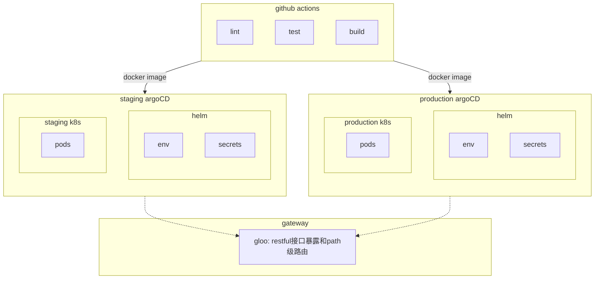

# Overview of current infrastructure

overview of current infrastructure

典型场景：

* a restful api
* a env
* a secret

1. dev -> test
2. generate secret by ci
3. configure env and secret on charts(helm)
4. merge into main branch(deploy into staging)
5. expose api by gloo on staging
6. trigger release workflow(deploy into prod)
7. expose api by gloo on prod
