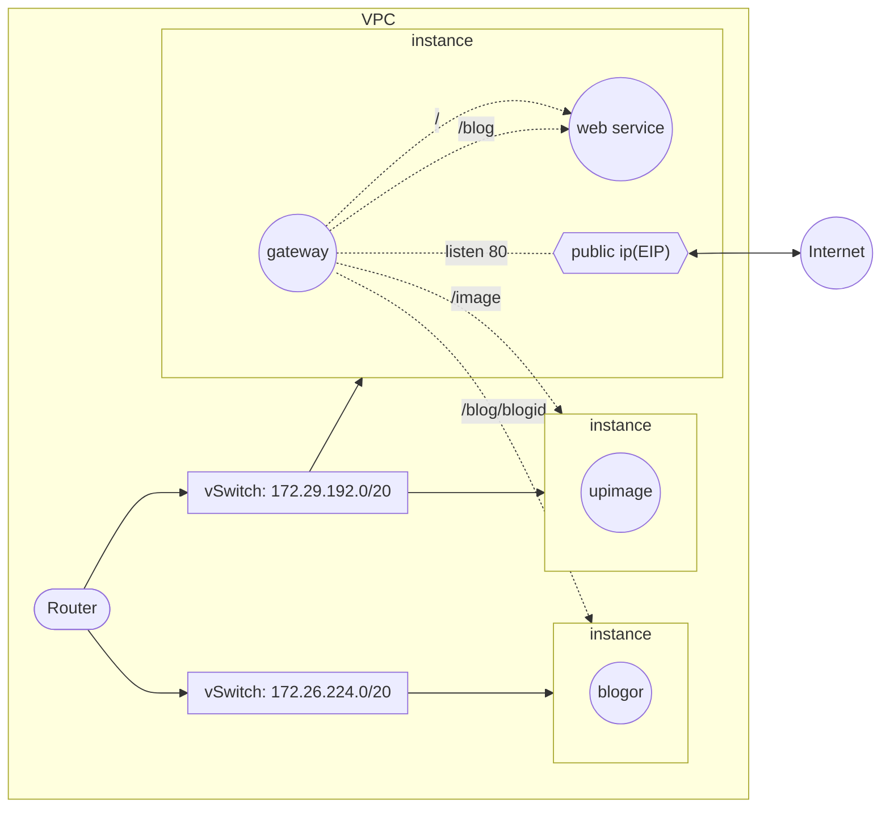

# Overview of current infrastructure

overview of current infrastructure

## Infrastructure in ECS

```mermaid
flowchart LR
  subgraph VPC

    subgraph ins_1[instance]
      blogor((blogor))
    end

    subgraph ins_2[instance]
      upimage((upimage))
    end
    
    subgraph ins_3[instance]
      webservice((web service))
      gateway((gateway))
      public_ip{{"public ip(EIP)"}}
    end

    router([Router])
    subgraph switch1[vSwitch: 172.26.224.0/20]
    
    end
    subgraph switch2[vSwitch: 172.29.192.0/20]
      
    end

    router --> switch1
    router --> switch2

    switch2 --> ins_3
    switch2 --> ins_2
    switch1 --> ins_1

    gateway -. / .-> webservice
    gateway -. /blog .-> webservice
    gateway -. /blog/blogid .-> ins_1
    gateway -. /image .-> ins_2

    gateway -. listen 80 .- public_ip

  end

  public_ip <--> internet((Internet))
```

