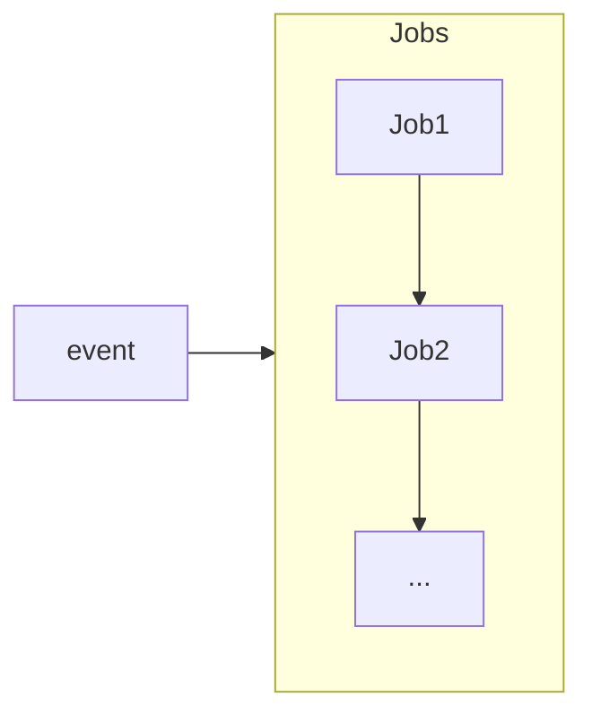
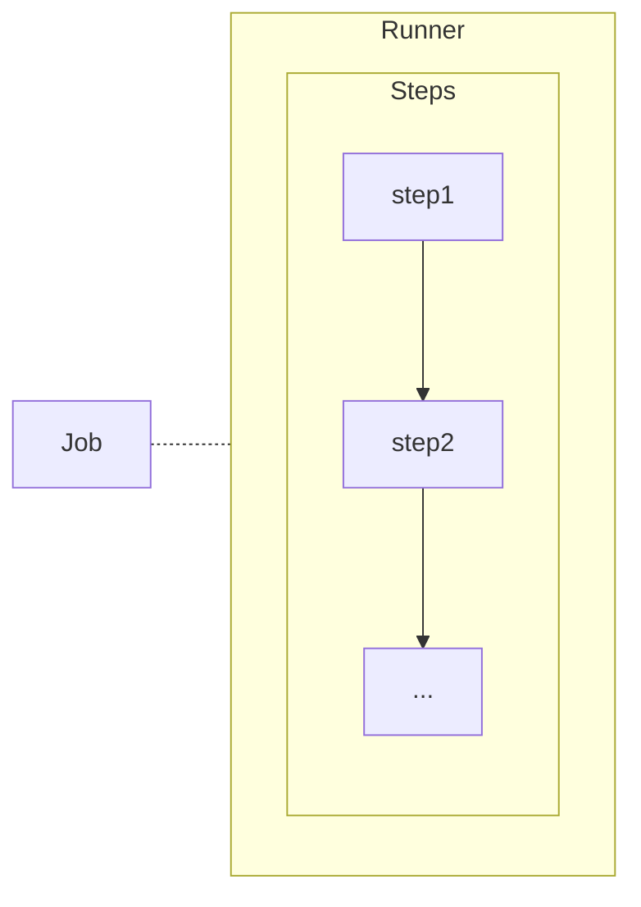
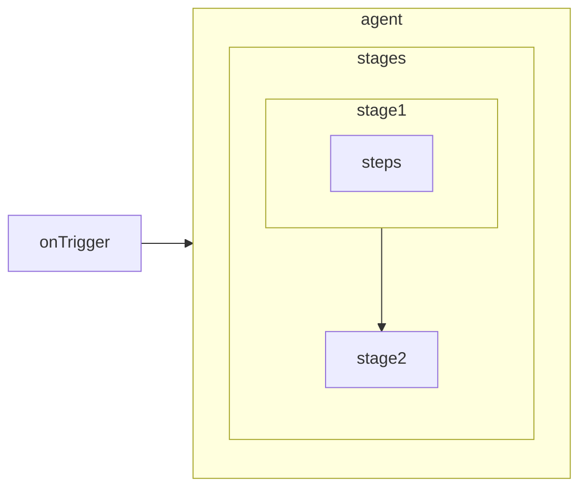
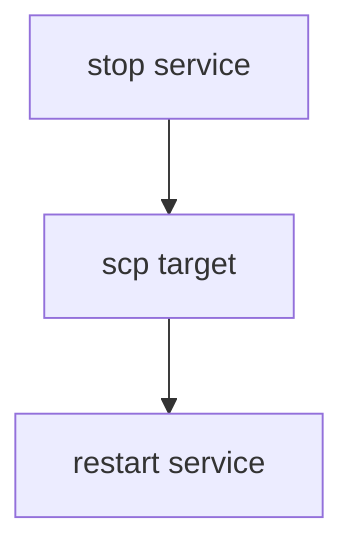
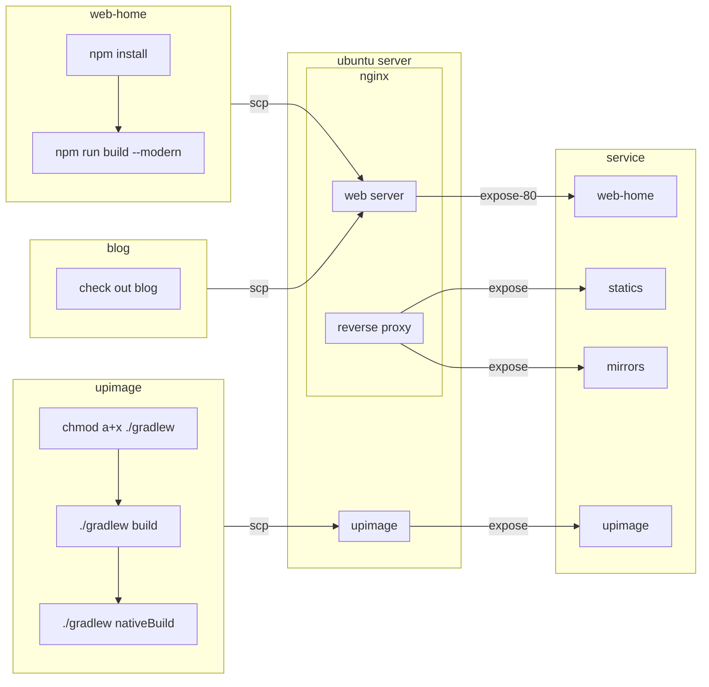

# easy ci and simple cd

try to use github actions to do simple ci/cd, try to use jenkins as well, aim to have a beautiful monitor.

## why ci/cd

Continuous delivery can help large organizations become as lean, agile and innovative as startups. Through reliable, low-risk releases, Continuous Delivery makes it possible to continuously adapt software in line with user feedback, shifts in the market and changes to business strategy. Test, support, development and operations work together as one delivery team to automate and streamline the build-test-release process.

## ci/cd tools

### github actions

#### advantage
* 源代码旁直接构建流水线
* 没有额外的服务器成本，github官方会提供性能可观的运行器
* actions marketplace 具有生态优势

支持的运行器和硬件资源

| Windows/Linux      | MaxOS              |
| ------------------ | ------------------ |
| 2 核 CPU           | 3 核 CPU           |
| 7 GB RAM 内存      | 14 GB RAM 内存     |
| 14 GB SSD 硬盘空间 | 14 GB SSD 硬盘空间 |

#### disadvantage
* 使用第三方的actions的安全性令人担忧
* 可视化效果较差
* 不能重新触发一个工作流的单独job，只能重新运行整个工作流，这使得长耗时的ci/cd变得不可接受
* 工作流复用成本比较高，要么依赖于脚本复用，要么自己发布GitHub actions达到复用的目的

### jenkins

#### advantage

* 深度可视化
* jenkins文档对中文的支持更加有友好。
* 特性丰富：能够加入人工确认，支持超时，重试和完成时动作
* 有非常强大的插件系统

#### disvantage

* 搭建成本
  
### UI
|         | github actions                                        | jenkins                                                                              |
| ------- | ----------------------------------------------------- | ------------------------------------------------------------------------------------ |
| monitor | [meercode](https://meercode.io/monitor/)              | [build view](http://dev.devecor.cn:8080/view/image/)                                 |
|         | [actions](https://github.com/Devecor/upimage/actions) | [bule ocean](http://dev.devecor.cn:8080/blue/organizations/jenkins/upimage/activity) |


### 代码复用

|                          | github actions                                                                                         | jenkins                                                                          |
| ------------------------ | ------------------------------------------------------------------------------------------------------ | -------------------------------------------------------------------------------- |
| 自定义脚本`sh script.sh` | :white_check_mark:                                                                                     | :white_check_mark:                                                               |
| 库共享                   | [reusing workflows](https://docs.github.com/cn/actions/learn-github-actions/reusing-workflows) :-1:    | [共享扩展库](https://www.jenkins.io/zh/doc/book/pipeline/shared-libraries/) :+1: |
| marketplace              | [actions marketplace](https://github.com/marketplace?category=&query=&type=actions&verification=) :+1: |                                                                                  |

### conclusion

jenkins 看起来是一个更加成熟的工具
但是github actions在源代码旁构建流水线的便利性和不要钱的算力，更能够吸引个人开发者和开源团队

## easy ci

### workflows





```yaml
name: blog cd
on:    # on event
  push:
    branches: [main]
jobs:    # job
  publish:    # job name
    runs-on: ubuntu-latest    # 分配运行器
    steps:
      - name: Checkout
        uses: actions/checkout@v2.3.4    # 调用第三方action
      
      - name: Publish
        run: echo "hello world"    # 执行命令或脚本
```

### pipline


```Groovy
pipeline {
  agent any    // 运行环境
  stages {    // 阶段
    stage('Build') {    // 拥有一个name
      steps {    // 步骤 不配拥有name
        sh '''
            chmod a+x gradlew
            ./gradlew build
        '''
      }
    }
  }
}
```


## simple cd



## web-home ci/cd



## 痛点

### ci耗时变长

1. 编译/打包 非常吃性能
   * github actions
     * github运行器：高耗时
     * 自托管运行器：可本地 :+1: 也可云端 :moneybag:
   * jenkins
     * 本地轮询
     * 云端配上webhook :moneybag:

2. 依赖多，下载耗时
  * jenkins: agent 指定为合适的docker image

3. 测试冗长
