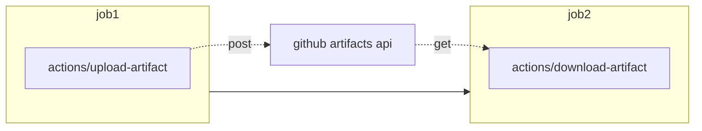
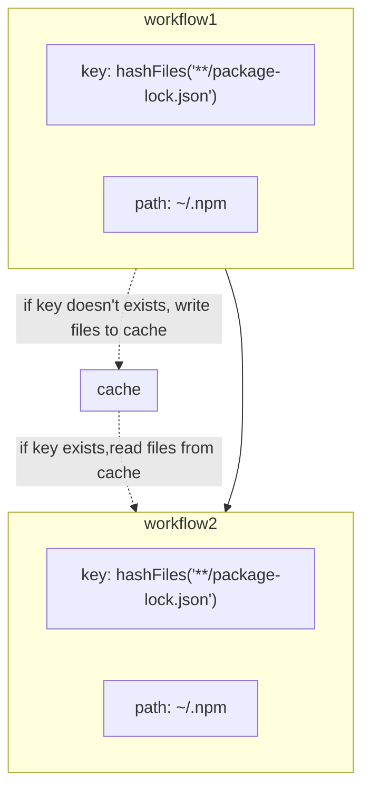

# Awesome notes of Github actions

`11%` of this notes accomplished!

There are three kinds of tips:

1. Items are worthwhile to highlight from the Github Actions official doc. See the details of [Chapter2 Actions tips](#chapter2-actions-tips)
2. Items are summarized by practical experience of myself which are not in the official doc. See the detals of [Chapter3 Pipeline tips](#chapter3-pipeline-tips) and [Chapter4 Practice tips](#chapter4-practice-tips)
3. The elegant items from the third party actions from my point of view. See [Chapter5 Elegant 3d-party actions](#chapter5-elegant-3d-party-actions)

## Contents
- [Awesome notes of Github actions](#awesome-notes-of-github-actions)
  - [Contents](#contents)
  - [Chapter1 Motivation](#chapter1-motivation)
  - [Chapter2 Actions tips](#chapter2-actions-tips)
    - [1. Share data among jobs](#1-share-data-among-jobs)
    - [2. Dependencies caches](#2-dependencies-caches)
    - [3. Workflow badges](#3-workflow-badges)
    - [4. Publish your artifacts](#4-publish-your-artifacts)
    - [5. Share data among workflows](#5-share-data-among-workflows)
    - [6. Reusable workflows](#6-reusable-workflows)
  - [Chapter3 Pipeline tips](#chapter3-pipeline-tips)
    - [1. Install ssh-keys](#1-install-ssh-keys)
    - [2. Version verification](#2-version-verification)
  - [Chapter4 Practice tips](#chapter4-practice-tips)
    - [1. When to self-host runners](#1-when-to-self-host-runners)
    - [2. 用以效率化脚本测试](#2-用以效率化脚本测试)
    - [3. 使用github organization共享pipeline资源](#3-使用github-organization共享pipeline资源)
  - [Chapter5 Elegant 3d-party actions](#chapter5-elegant-3d-party-actions)
    - [1.覆盖率徽章](#1覆盖率徽章)

## Chapter1 Motivation

I'm really like following features of Github Actions:

* Pipeline that is close to github repository!
* Github hosted runners is provided!
* Github Actions marketplace!

Supported runners and hardware resources:

| Windows/Linux          | MaxOS                  |
| ---------------------- | ---------------------- |
| 2-core CPU             | 3-core CPU             |
| 7GB of RAM memory      | 14GB of RAM memory     |
| 14GB of SSD disk space | 14GB of SSD disk space |

However, these are the reasons only for we like it instead of using it by default without trade-off.

> GitHub Actions has grown considerably last year. It has proven that it can take on more complex workflows and call other actions in composite actions among other things. It still has some shortcomings, though, such as its inability to re-trigger a single job of a workflow. Although the ecosystem in the GitHub Marketplace has its obvious advantages, giving third-party GitHub Actions access to your build pipeline risks sharing secrets in insecure ways.
> ---[Thoughtworks Technology Radar](https://www.thoughtworks.com/radar/platforms/github-actions)

Anyway, you are reading this blog, I know you have experience of using `Github actions`. you've come to the right place because of gread minds think alike!

## Chapter2 Actions tips

### 1. Share data among jobs

Github actions forces that each job runs in a dedicated runner. There are two approaches we have to share data among jobs:

(1) Artifacts - upload/download files

Artifacts allow you to share data between jobs in a workflow and store data once that workflow has completed.



Here is the simplest example:

> :memo: **Note:** For simplicity's sake, let's keep the examples simple

```yaml
  job1:
    steps:
      - name: Share text file with other jobs
        uses: actions/upload-artifact@v2
        with:
          name: text
          path: text.txt

  job2:
    needs: job1
    steps:
      - name: Download text.txt
        uses: actions/download-artifact@v2
        with:
          name: text

      - run: cat text.txt
```

(2) job's outputs - read leading job's outputs

if case we have a dependent job and leading job have it's outputs, we can read the outputs by `needs.{leading job}.outputs.{leading job's outputs}` for example:

```yaml
jobs:
  job1:
    outputs:
      out: ${{ steps.my_step.my_output }}
    steps:
      - id: my_step
        run: echo "::set-output name=my_output::hello"
  job2:
    needs: job1
    steps:
      - run: echo "${{ needs.job1.outputs.out }}"
```


### 2. Dependencies caches

Jobs on GitHub-hosted runners start in a clean virtual environment and must download dependencies each time, causing increased network utilization, longer runtime, and increased cost. To help speed up the time it takes to recreate these files, GitHub can cache dependencies you frequently use in workflows.



```yaml
      - uses: actions/cache@v2
        with:
          path: ~/.npm
          key: ${{ runner.os }}-node-${{ hashFiles('**/package-lock.json') }}
          restore-keys: |
            ${{ runner.os }}-node-
```

If you are caching the package managers listed below, consider using the respective setup-* actions, which require almost zero configuration and are easy to use.

| Package managers | setup-* action for caching |
| ---------------- | -------------------------- |
| npm, yarn, pnpm  | setup-node                 |
| pip, pipenv      | setup-python               |
| gradle, maven    | setup-java                 |
| ruby gems        | setup-ruby                 |


### 3. Workflow badges

Looks like：  


Github actions will generate this badge by default. You can link it to your README file.

```markdown
[](https://github.com/<user>/<repo>/actions/workflows/<workflow>.yml)
```


### 4. Publish your artifacts

* You probably need to publish/consume your artifacts or share your application/service with people. github packages registry is a good choice in workflows.
  * For more infomation, see [github packages registry](https://docs.github.com/cn/packages/working-with-a-github-packages-registry)
* Also we can upload a executable file/zip/binary into github release via github actions workflow.

```yaml
      - name: Upload Release Asset
        uses: actions/upload-release-asset@v1
        env:
          GITHUB_TOKEN: ${{ secrets.GITHUB_TOKEN }}
        with:
          upload_url: ${{ env.UPLOAD_URL }}
          asset_path: ./build/libs/upimage-${{ env.UPIMAGE_VERSION }}.jar
          asset_name: upimage-${{ env.UPIMAGE_VERSION }}.jar
          asset_content_type: application/zip
```


### 5. Share data among workflows

We share data among `jobs` via `github artifacts` or job's outputs. what about data sharing among workflows?

Really interesting, `actions/cache@v2` is adequate for our needs.

> :memo: **Note:** job is so powerful can finish most of work. even if you have to share data among workflows, please keep data limited:

1. keep data short-life
2. avoid secrets

A tricky scenario that I have encountered is:

> There are two serial jobs, the second one depends on the first one, and it is expected that the second one must be manually confirmed before it can be executed.

The easiest way to achieve it is [github environment](https://docs.github.com/en/actions/deployment/targeting-different-environments/using-environments-for-deployment). Unfortunately, github free plan didn't allow to try it in a private repository.

So I make the two jobs become two separate workfolw. Leave the second one triggered by workflow call and fetch data from cache.

### 6. Reusable workflows

> Rather than copying and pasting from one workflow to another, you can make workflows reusable.
> ---[Github Actions](https://docs.github.com/en/actions/using-workflows/reusing-workflows)

There are three approaches to avoid duplication.
1. scripts
2. 3rdparty actions from marketplace - it's also script, but in the form of docker container or javascript actions.
3. reusable workflows

WIP

## Chapter3 Pipeline tips

### 1. Install ssh-keys

We often run some remote command via ssh in the practice for CI/CD pipeline. That means we have to configure key-pairs in github actions runner.

> :memo: **Warning:** do not use 3rdparty Github Actions to install key pair.

> giving third-party GitHub Actions
access to your build pipeline risks sharing secrets in insecure ways
> ---[thoughtworks technology radar](https://www.thoughtworks.com/radar/platforms/github-actions)

I suggest to do it by ourselves:

```yaml
      - name: Install ssh-key
        run: |
          mkdir -p ~/.ssh
          echo "${{ secrets.SSH_KEY }}" > ~/.ssh/id_ed25519
          chmod 600 ~/.ssh/id_ed25519
          eval "$(ssh-agent -s)"
          ssh-add ~/.ssh/id_ed25519
          ssh-keyscan -H "${{ secrets.TARGET_SERVER }}" >> ~/.ssh/known_hosts
      
      - name: Your step for deploy
        continue-on-error: true
        run: |
          ssh xxx

      - name: Delete ssh-key
        run: rm ~/.ssh/id_ed25519
```

> :memo: **Note:** You should configure your step for deploying with `continue-on-error: true`, since the step to delete key-pair will not be executed in case of exception happenning in deploy step.

### 2. Version verification

持续集成部署常常伴随着版本号的快速更迭，各类打包和发布平台都需要一个独一无二的版本号标识当前构建。没有理由抛开版本号不用，对吧？

这里笔者提倡每次提交都要手动提升版本号，否则ci将会失败。在ci里自动的提升版本，会让人放弃思考变更大版本或者小版本，极有可能出现`0.0.889`这样看起来funny的版本号

我们可以使用git tag来标记最新版本，在ci里从配置文件里取出版本号与git tag进行对比确定是否正确提升了版本


## Chapter4 Practice tips

### 1. When to self-host runners

* 私仓，商业团队使用,超出免费的500M/2000分钟额度并希望节省成本之时。
* 希望保护在ci中使用的secrets之时。

建议不要使用自托管运行器的情况：

* 不能科学上网的网络环境：提交签出极为耗时

### 2. 用以效率化脚本测试

很多时候笔者会为无脑重复的操作写一个效率化脚本, github actions能提供一个良好的测试环境，特别是Mac os是个比较难得的测试环境。比如下面的例子：

1. mac一行命令安装一个[docker的代替品](https://github.com/DevecorSoft/DockerDesktopAlternative)：这个项目利用了github actions提供的`macos-latest`测试环境

### 3. 使用github organization共享pipeline资源


## Chapter5 Elegant 3d-party actions

### 1.覆盖率徽章

如果可以在readme文件里看到你的项目有极高的测试覆盖率是否能给你带来信心？


最简单的用法莫过于在ci中生成svg格式的徽章提交到代码库, 最后在readme文件中使用相对路径引用

actions 地址: 

* 基于jacoco的徽章生成器: [cicirello/jacoco-badge-generator](https://github.com/marketplace/actions/jacoco-badge-generator)
* 通用徽章生成器： [badgen](https://github.com/badgen/badgen.net)

