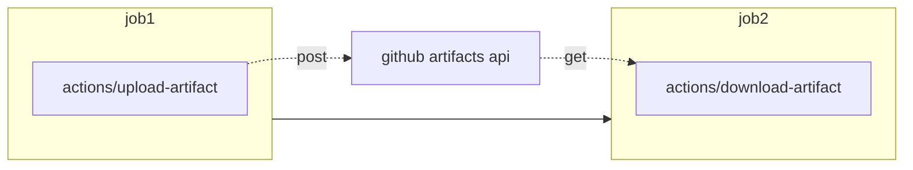
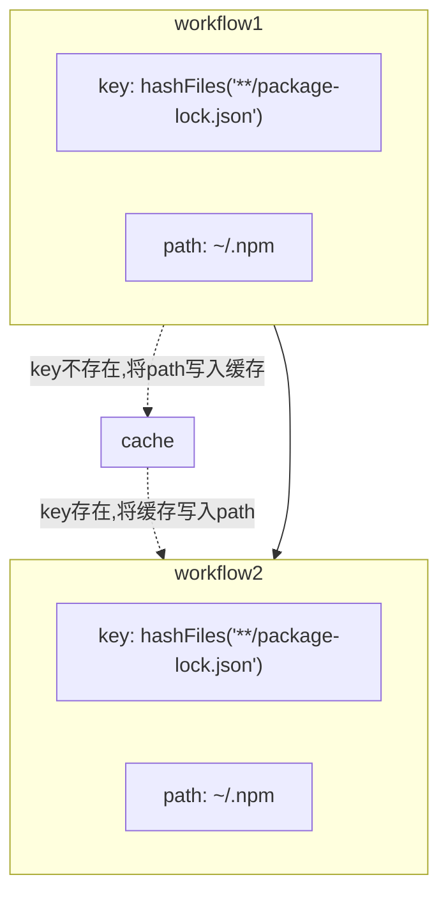

# Github actions 的100个实用技巧

100实用小技巧，希望能写到100个

## actions技巧篇

### 1. 跨job的数据共享

github actions为每一个作业单独分配运行器, 这使得跨越job的数据和配置共享需要额外的步骤



最简单的方式莫过于利用github提供的artifacts. 即在上游job中将数据或者配置打印成文本文件，利用[actions/upload-artifact](https://github.com/marketplace/actions/upload-a-build-artifact)上传至artifact。下游job中利用[actions/download-artifact](https://github.com/marketplace/actions/download-a-build-artifact)下载


### 2.依赖缓存



```yaml
      - uses: actions/cache@v2
        with:
          path: ~/.npm
          key: ${{ runner.os }}-node-${{ hashFiles('**/package-lock.json') }}
          restore-keys: |
            ${{ runner.os }}-node-
```

github actions 提供[依赖缓存](https://docs.github.com/cn/actions/advanced-guides/caching-dependencies-to-speed-up-workflows)功能加速你的ci/cd，适用于`Maven, Gradle, npm, and Yarn`


### 3.ci红绿状态徽章
只要workflow存在，github就会为你生成状态徽章，可利用以下规则在readme中引用（点击`Create status badge`复制链接)

```markdown
[](https://github.com/<user>/<repo>/actions/workflows/<workflow>.yml)
```


### 4.发布你的应用

* 在ci中发布到github package
  * github提供[github packages registry](https://docs.github.com/cn/packages/working-with-a-github-packages-registry)
* 在ci中发布github release
  * 可使用`actions/upload-release-asset`上传到github release


## pipeline技巧篇

### 1.安装ssh-keys

```yaml
      - name: Install ssh-key
        run: |
          mkdir -p ~/.ssh
          echo "${{ secrets.SSH_KEY }}" > ~/.ssh/id_ed25519
          chmod 600 ~/.ssh/id_ed25519
          eval "$(ssh-agent -s)"
          ssh-add ~/.ssh/id_ed25519
          ssh-keyscan "${{ secrets.TARGET_SERVER }}" >> ~/.ssh/known_hosts

      - name: Delete ssh-key
        run: rm ~/.ssh/id_ed25519
```

### 2.版本号提升验证

每次提交都要手动提升版本号，否则ci将会失败


## 优雅的第三方Actions

### 1.覆盖率徽章

actions 地址: [cicirello/jacoco-badge-generator](https://github.com/marketplace/actions/jacoco-badge-generator)

1. 基于jacoco的徽章生成器，最简单的用法莫过于在ci中生成svg格式的徽章提交到代码库, 最后在readme文件中使用相对路径引用
