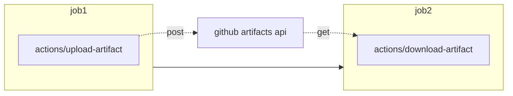

# Github actions 的100个实用技巧

100实用小技巧，希望能写到100个

## actions技巧篇

### 跨job的数据共享

github actions为每一个作业单独分配运行器, 这使得跨越job的数据和配置共享需要额外的步骤

### 依赖缓存

github actions 提供[依赖缓存](https://docs.github.com/cn/actions/advanced-guides/caching-dependencies-to-speed-up-workflows)功能加速你的ci/cd，适用于`Maven, Gradle, npm, and Yarn`

### 发布你的应用

* github package
* release

最简单的方式莫过于利用github提供的artifacts. 即在上游job中将数据或者配置打印成文本文件，利用[actions/upload-artifact](https://github.com/marketplace/actions/upload-a-build-artifact)上传至artifact。下游job中利用[actions/download-artifact](https://github.com/marketplace/actions/download-a-build-artifact)下载

## pipeline技巧篇

### 安装ssh-keys

### 版本号提升验证

## 优雅的第三方Actions

### 覆盖率徽章

actions 地址: [cicirello/jacoco-badge-generator](https://github.com/marketplace/actions/jacoco-badge-generator)

1. 基于jacoco的徽章生成器，最简单的用法莫过于在ci中生成svg格式的徽章提交到代码库, 最后在readme文件中使用相对路径引用
