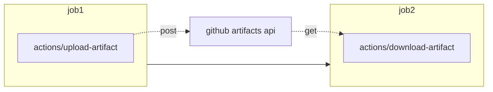
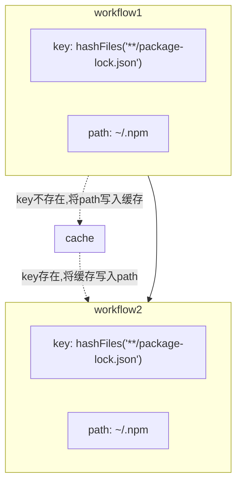

# Github actions 的100个实用技巧

100个Github actions实用小技巧。已完成`11%`

本文收录的所有技巧分为三类：

1. Github actions官方文档中存在，而笔者认为需要highlight出来的技巧，见[actions技巧篇](#actions技巧篇)
2. Github actions官方文档中不存在，由笔者实践经验总结而来，见[pipeline技巧篇](#pipeline技巧篇)和[实践技巧篇](#实践技巧篇)
3. 笔者认为非常优雅的第三方Actions名录，见[优雅的第三方Actions](#优雅的第三方actions)

本文并不是一篇适合用来入门`Github actions`的文章，我推荐你完成官方文档的教程[Learn github actions](https://docs.github.com/en/actions/learn-github-actions)。若你在实践中遇到麻烦，相信本文能带给你惊喜。

## 目录
- [Github actions 的100个实用技巧](#github-actions-的100个实用技巧)
  - [目录](#目录)
  - [动机篇](#动机篇)
  - [actions技巧篇](#actions技巧篇)
    - [1. 跨job的数据共享](#1-跨job的数据共享)
    - [2.依赖的缓存](#2依赖的缓存)
    - [3. 作业的矩阵策略](#3-作业的矩阵策略)
    - [4.ci红绿状态徽章](#4ci红绿状态徽章)
    - [5. 一个可手动触发工作流的选项](#5-一个可手动触发工作流的选项)
    - [6. using OIDC](#6-using-oidc)
  - [pipeline技巧篇](#pipeline技巧篇)
    - [1.安装ssh-keys](#1安装ssh-keys)
    - [3. 为作业设置超时](#3-为作业设置超时)
    - [4. 避免在不信任的runner上安装凭证](#4-避免在不信任的runner上安装凭证)
    - [2.版本号提升验证](#2版本号提升验证)
  - [实践技巧篇](#实践技巧篇)
    - [1. 自托管runner的时机](#1-自托管runner的时机)
    - [2. 用以效率化脚本测试](#2-用以效率化脚本测试)
    - [3. 使用github organization共享pipeline资源](#3-使用github-organization共享pipeline资源)
    - [4. 适当限制actions的权限](#4-适当限制actions的权限)
  - [优雅的第三方Actions](#优雅的第三方actions)
    - [1.覆盖率徽章](#1覆盖率徽章)
    - [4.发布你的应用](#4发布你的应用)

## 动机篇

github actions因具有以下优点而深受笔者喜爱：

* 生来就具有Github生态优势，可轻易自动化的使用`github package`，`github pages`，`issue/pull_request`等。
* `99%`的功能都是可选的，易用性极高，你经常会惊喜的发现满足需求的新特性，官方早已准备好。
* 没有额外的服务器成本，github官方会提供性能可观的运行器

支持的运行器和硬件资源：

| Windows/Linux      | MaxOS              |
| ------------------ | ------------------ |
| 2 核 CPU           | 3 核 CPU           |
| 7 GB RAM 内存      | 14 GB RAM 内存     |
| 14 GB SSD 硬盘空间 | 14 GB SSD 硬盘空间 |

我们喜欢这些特性，并不意味着我们要不加权衡的使用它。事实上，你可能需要知道：

> GitHub Actions 的使用量在去年大幅增长。之前的使用经历已经证明它可以处理更复杂的工作流程，并在
复合操作中调用其他操作。但是，它仍存在一些缺点，例如无法重新触发工作流的单个作业。尽管 GitHub
Marketplace 中的生态系统有其明显的优势，但让作为第三方的 GitHub Actions 访问你的构建流水线可能会以不安全的方式共享机密信息
> 
> ---[Thoughtworks 技术雷达](https://www.thoughtworks.com/radar/platforms/github-actions)

## actions技巧篇

### 1. 跨job的数据共享

github actions为每一个作业单独分配运行器, 这使得跨越job(同一个workflow)的数据和配置共享需要额外的步骤。我们有两种方式可以选择：

- upload/download artifact - 共享文件



最简单的方式莫过于利用github提供的artifacts. 即在上游job中将数据或者配置打印成文本文件(你当然能够选择任何压缩格式)，利用[actions/upload-artifact](https://github.com/marketplace/actions/upload-a-build-artifact)上传至artifact。下游job中利用[actions/download-artifact](https://github.com/marketplace/actions/download-a-build-artifact)下载

也许笔者应该在此处提供一个例子:

> :memo: **Note:** 简单起见，还是让例子简单一点（隐藏了工作流的其他部分）

```yaml
  job1:
    steps:
      - name: Share text file with other jobs
        uses: actions/upload-artifact@v2
        with:
          name: text
          path: text.txt

  job2:
    needs: job1
    steps:
      - name: Download text.txt
        uses: actions/download-artifact@v2
        with:
          name: text

      - run: cat text.txt
```

> :memo: **Note:** 注意这两个作业时存在依赖关系的，不要忘了设定下游作业的先决条件：`needs: [job1]`

- job's outputs - 共享简单数据

若两个作业存在依赖关系, 前置作业拥有`outputs`，则可在下游作业中使用`needs.{leading job}.outputs.{leading job's outputs}`获得前置作业的输出，例如

```yaml
jobs:
  job1:
    outputs:
      out: ${{ steps.my_step.my_output }}
    steps:
      - id: my_step
        run: echo "::set-output name=my_output::hello"
  job2:
    needs: job1
    steps:
      - run: echo "${{ needs.job1.outputs.out }}"
```

值得注意的是，这种方法只能用来传递键值对数据，实例中的`run: echo "::set-output name=my_output::hello"` 可能会让人很费解，具体的语法超出本文想讨论的范畴，可参考官方文档[workflow command](https://docs.github.com/en/actions/using-workflows/workflow-commands-for-github-actions#example-setting-a-value)

### 2.依赖的缓存

> 在Gihtub托管的运行器上运行的作业开始于一个干净的虚拟环境，每次都会下载依赖。这造成了高网络占用，长运行时间和大的费用。Github能够通过缓存你在工作流中常用的文件来加速你的依赖下载时间。
> 
> ---[Github actions doc](https://docs.github.com/en/actions/using-workflows/caching-dependencies-to-speed-up-workflows)

尽管缓存作为一个常用的手段，这个条目仍然出现在这里是因为其加速效果极其明显。下载速度直接拉满，常常高达`120MBs/sec`：




```yaml
      - uses: actions/cache@v2
        with:
          path: ~/.npm
          key: ${{ runner.os }}-node-${{ hashFiles('**/package-lock.json') }}
          restore-keys: |
            ${{ runner.os }}-node-
```

下列语言/平台的安装actions提供了`cache`参数，可供快速配置依赖缓存

| Package managers | setup-* action for caching |
| ---------------- | -------------------------- |
| npm, yarn, pnpm  | setup-node                 |
| pip, pipenv      | setup-python               |
| gradle, maven    | setup-java                 |
| ruby gems        | setup-ruby                 |

> :memo: **Note:** 如果你的每次提交都会变更项目配置文件(package.json,pom.xml,build.gradle.kts等), 缓存会失效，原因是默认将这些文件哈希值（`hashFiles`）作为`key`, 此时你需要直接使用`action/cache`并提供自己的`key`


### 3. 作业的矩阵策略


### 4.ci红绿状态徽章

看起来是这样：  


它会显示流水线的实时状态，可作为一个监视器。

只要workflow存在，github就会为你生成状态徽章，可利用以下规则在readme中引用（在项目的actions里点击`Create status badge`复制链接最简单)

```markdown
[](https://github.com/<user>/<repo>/actions/workflows/<workflow>.yml)
```

### 5. 一个可手动触发工作流的选项
在ci/cd实践还没那么成熟时，这是一个可选项

### 6. using OIDC


## pipeline技巧篇

### 1.安装ssh-keys

自动化部署时常常需要执行scp rsync命令或者在目标主机执行命令，这就需要正确配置运行器的ssh-keys。建议不要使用第三方的Github actions来安装key-pair凭证。

> 让作为第三方的 GitHub Actions 访问你的构建流水线可能会以不安全的方式共享机密信息
> ---[thoughtworks 技术雷达](https://www.thoughtworks.com/radar/platforms/github-actions)

笔者推荐下列方式来配置你的ssh凭证：

```yaml
      - name: Install ssh-key
        run: |
          mkdir -p ~/.ssh
          echo "${{ secrets.SSH_KEY }}" > ~/.ssh/id_ed25519
          chmod 600 ~/.ssh/id_ed25519
          eval "$(ssh-agent -s)"
          ssh-add ~/.ssh/id_ed25519
          ssh-keyscan -H "${{ secrets.TARGET_SERVER }}" >> ~/.ssh/known_hosts
      
      - name: Your step for deploy
        continue-on-error: true
        run: |
          ssh xxx

      - name: Delete ssh-key
        run: rm ~/.ssh/id_ed25519
```

> :memo: **Note:** 值得注意的是，我们最好在部署步骤结束后移除你的key-pair凭证。但是如果你的部署步骤失败了，移除key-pair的步骤就得不到执行，不要忘记给你用来部署的步骤加上`continue-on-error: true`声明。

### 3. 为作业设置超时

### 4. 避免在不信任的runner上安装凭证

### 2.版本号提升验证

持续集成部署常常伴随着版本号的快速更迭，各类打包和发布平台都需要一个独一无二的版本号标识当前构建。没有理由抛开版本号不用，对吧？

这里笔者提倡每次提交都要手动提升版本号，否则ci将会失败。在ci里自动的提升版本，会让人放弃思考变更大版本或者小版本，极有可能出现`0.0.889`这样看起来funny的版本号

我们可以使用git tag来标记最新版本，在ci里从配置文件里取出版本号与git tag进行对比确定是否正确提升了版本


## 实践技巧篇

### 1. 自托管runner的时机

* 私仓，商业团队使用,超出免费的500M/2000分钟额度并希望节省成本之时。
* 希望保护在ci中使用的secrets之时。
* 自定义github-hosted runner没有提供的环境时。

建议不要使用自托管运行器的情况：

* 不能科学上网的网络环境：提交签出极为耗时

### 2. 用以效率化脚本测试

很多时候笔者会为无脑重复的操作写一个效率化脚本, github actions能提供一个良好的测试环境，特别是Mac os是个比较难得的测试环境。比如下面的例子：

1. mac一行命令安装一个[docker的代替品](https://github.com/DevecorSoft/DockerDesktopAlternative)：这个项目利用了github actions提供的`macos-latest`测试环境

### 3. 使用github organization共享pipeline资源
出于便利性考虑

> An organization allows you to centrally store and manage secrets, artifacts, and self-hosted runners. You can also create starter workflows in the .github repository and share them with other users in your organization.
> 
> ---github actions doc


### 4. 适当限制actions的权限
出于安全性的考虑

https://docs.github.com/en/organizations/managing-organization-settings/disabling-or-limiting-github-actions-for-your-organization


## 优雅的第三方Actions

### 1.覆盖率徽章

如果可以在readme文件里看到你的项目有极高的测试覆盖率是否能给你带来信心？


最简单的用法莫过于在ci中生成svg格式的徽章提交到代码库, 最后在readme文件中使用相对路径引用

actions 地址: 

* 基于jacoco的徽章生成器: [cicirello/jacoco-badge-generator](https://github.com/marketplace/actions/jacoco-badge-generator)
* 通用徽章生成器： [badgen](https://github.com/badgen/badgen.net)


### 4.发布你的应用

* 在ci中发布到github package
  * github提供[github packages registry](https://docs.github.com/cn/packages/working-with-a-github-packages-registry)
* 在ci中发布github release
  * 可使用`actions/upload-release-asset`上传到github release

```yaml
      - name: Upload Release Asset
        uses: actions/upload-release-asset@v1
        env:
          GITHUB_TOKEN: ${{ secrets.GITHUB_TOKEN }}
        with:
          upload_url: ${{ env.UPLOAD_URL }}
          asset_path: ./build/libs/upimage-${{ env.UPIMAGE_VERSION }}.jar
          asset_name: upimage-${{ env.UPIMAGE_VERSION }}.jar
          asset_content_type: application/zip
```


