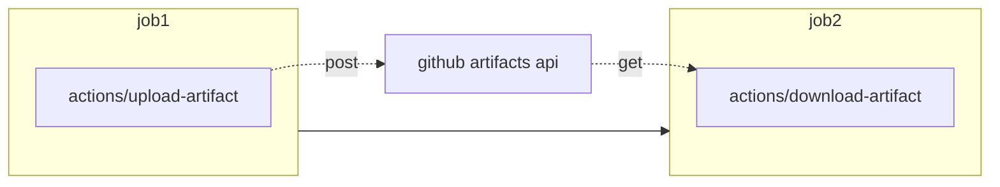
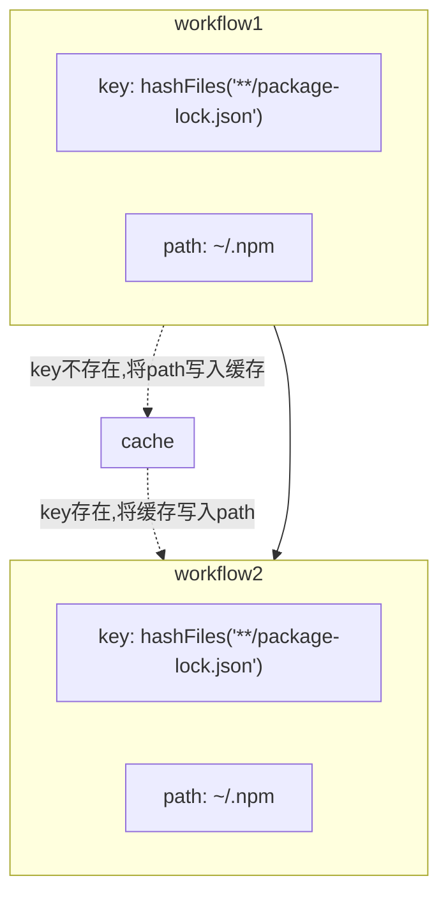

# Github actions 的100个实用技巧

100实用小技巧，希望能写到100个

- [Github actions 的100个实用技巧](#github-actions-的100个实用技巧)
  - [动机篇](#动机篇)
  - [actions技巧篇](#actions技巧篇)
    - [1. 跨job的数据共享](#1-跨job的数据共享)
    - [2.依赖缓存](#2依赖缓存)
    - [3.ci红绿状态徽章](#3ci红绿状态徽章)
    - [4.发布你的应用](#4发布你的应用)
    - [5. 跨越workflow的数据共享](#5-跨越workflow的数据共享)
  - [pipeline技巧篇](#pipeline技巧篇)
    - [1.安装ssh-keys](#1安装ssh-keys)
    - [2.版本号提升验证](#2版本号提升验证)
  - [实践技巧篇](#实践技巧篇)
    - [1. 自托管runner的时机](#1-自托管runner的时机)
    - [2. 用以效率化脚本测试](#2-用以效率化脚本测试)
  - [优雅的第三方Actions](#优雅的第三方actions)
    - [1.覆盖率徽章](#1覆盖率徽章)

## 动机篇

github actions因具有以下优点而深受笔者喜爱

* 源代码旁直接构建流水线
* 没有额外的服务器成本，github官方会提供性能可观的运行器
* actions marketplace 具有生态优势

支持的运行器和硬件资源

| Windows/Linux      | MaxOS              |
| ------------------ | ------------------ |
| 2 核 CPU           | 3 核 CPU           |
| 7 GB RAM 内存      | 14 GB RAM 内存     |
| 14 GB SSD 硬盘空间 | 14 GB SSD 硬盘空间 |

当然，这并不代表github acitons没有缺点，相反，其缺点又多又明显，本文不再列举。总之，上面列举的三个优点足以让笔者忽视/忍受各种已知的缺点。

## actions技巧篇

### 1. 跨job的数据共享

github actions为每一个作业单独分配运行器, 这使得跨越job(同一个workflow)的数据和配置共享需要额外的步骤



最简单的方式莫过于利用github提供的artifacts. 即在上游job中将数据或者配置打印成文本文件(你当然能够选择任何压缩格式)，利用[actions/upload-artifact](https://github.com/marketplace/actions/upload-a-build-artifact)上传至artifact。下游job中利用[actions/download-artifact](https://github.com/marketplace/actions/download-a-build-artifact)下载

也许笔者应该在此处提供一个例子:

> :memo: **Note:** 简单起见，还是让例子简单一点

```yaml
  job1:
    steps:
      - name: Share text file with other jobs
        uses: actions/upload-artifact@v2
        with:
          name: text
          path: text.txt

  job2:
    steps:
      - name: Download text.txt
        uses: actions/download-artifact@v2
        with:
          name: text

      - run: cat text.txt
```


### 2.依赖缓存



```yaml
      - uses: actions/cache@v2
        with:
          path: ~/.npm
          key: ${{ runner.os }}-node-${{ hashFiles('**/package-lock.json') }}
          restore-keys: |
            ${{ runner.os }}-node-
```

github actions 提供[依赖缓存](https://docs.github.com/cn/actions/advanced-guides/caching-dependencies-to-speed-up-workflows)功能加速你的ci/cd，适用于`Maven, Gradle, npm, and Yarn`等

下列语言/平台的安装actions提供了`cache`参数，可供快速配置依赖缓存

| Package managers | setup-* action for caching |
| ---------------- | -------------------------- |
| npm, yarn, pnpm  | setup-node                 |
| pip, pipenv      | setup-python               |
| gradle, maven    | setup-java                 |
| ruby gems        | setup-ruby                 |

note that：如果你的每次提交都会变更项目配置文件(package.json,pom.xml,build.gradle.kts等), 缓存会失效，原因是默认将这些文件哈希值（`hashFiles`）作为`key`, 此时你需要直接使用`action/cache`并提供自己的`key`


### 3.ci红绿状态徽章
看起来是这样：  


只要workflow存在，github就会为你生成状态徽章，可利用以下规则在readme中引用（在项目的actions里点击`Create status badge`复制链接最简单)

```markdown
[](https://github.com/<user>/<repo>/actions/workflows/<workflow>.yml)
```


### 4.发布你的应用

* 在ci中发布到github package
  * github提供[github packages registry](https://docs.github.com/cn/packages/working-with-a-github-packages-registry)
* 在ci中发布github release
  * 可使用`actions/upload-release-asset`上传到github release

```yaml
      - name: Upload Release Asset
        uses: actions/upload-release-asset@v1
        env:
          GITHUB_TOKEN: ${{ secrets.GITHUB_TOKEN }}
        with:
          upload_url: ${{ env.UPLOAD_URL }}
          asset_path: ./build/libs/upimage-${{ env.UPIMAGE_VERSION }}.jar
          asset_name: upimage-${{ env.UPIMAGE_VERSION }}.jar
          asset_content_type: application/zip
```


### 5. 跨越workflow的数据共享

当我们希望跨job共享数据的时候使用`github artifacts`,那么跨越workflow的数据共享呢？

答案是`actions/cache@v2`, 你没有看错就是前文依赖缓存用的cache

首先，我认为实践中应尽量避免跨越workflow的共享数据，job中可以完成足够多的事情。

即便你遇到了不得不用的场景，也请克制：

1. 保持数据短命，github有存储限制，达到或者过期会被删除或者覆盖掉
2. 避免敏感数据，对于同`pull_request`触发的工作流来说，缓存的数据可以轻易拿到

笔者所遇到的一个应用场景是：

存在两个串行的job，第二个依赖于第一个job，并且希望第二个job必须得到人工确认才能执行。

最简单的办法是使用github environment, 不幸的是，github free plan的私仓不支持这一特性，同时不想花钱买github enterprise plan。

于是将这两个job拆成两个workflow，第二个由人工手动触发，并使用`actions/cache@v2`共享数据。

## pipeline技巧篇

### 1.安装ssh-keys

自动化部署时常常需要执行scp rsync命令或者在目标主机执行命令，这就需要正确配置运行器的ssh-keys

```yaml
      - name: Install ssh-key
        run: |
          mkdir -p ~/.ssh
          echo "${{ secrets.SSH_KEY }}" > ~/.ssh/id_ed25519
          chmod 600 ~/.ssh/id_ed25519
          eval "$(ssh-agent -s)"
          ssh-add ~/.ssh/id_ed25519
          ssh-keyscan -H "${{ secrets.TARGET_SERVER }}" >> ~/.ssh/known_hosts
```

部署结束时一定不要忘了移除运行器的ssh-key凭证

```yaml
      - name: Delete ssh-key
        run: rm ~/.ssh/id_ed25519
```

### 2.版本号提升验证

持续集成部署常常伴随着版本号的快速更迭，各类打包和发布平台都需要一个独一无二的版本号标识当前构建。没有理由抛开版本号不用，对吧？

这里笔者提倡每次提交都要手动提升版本号，否则ci将会失败。在ci里自动的提升版本，会让人放弃思考变更大版本或者小版本，极有可能出现`0.0.889`这样看起来funny的版本号

我们可以使用git tag来标记最新版本，在ci里从配置文件里取出版本号与git tag进行对比确定是否正确提升了版本


## 实践技巧篇

### 1. 自托管runner的时机

* 私仓，商业团队使用,超出免费的500M/2000分钟额度并希望节省成本之时。
* 希望保护在ci中使用的secrets之时。

建议不要使用自托管运行器的情况：

* 不能科学上网的网络环境：提交签出极为耗时

### 2. 用以效率化脚本测试

很多时候笔者会为无脑重复的操作写一个效率化脚本, github actions能提供一个良好的测试环境，特别是Mac os是个比较难得的测试环境。比如下面的例子：

1. mac一行命令安装一个[docker的代替品](https://github.com/DevecorSoft/DockerDesktopAlternative)：这个项目利用了github actions提供的`macos-latest`测试环境


## 优雅的第三方Actions

### 1.覆盖率徽章

如果可以在readme文件里看到你的项目有极高的测试覆盖率是否能给你带来信心？


最简单的用法莫过于在ci中生成svg格式的徽章提交到代码库, 最后在readme文件中使用相对路径引用

actions 地址: 

* 基于jacoco的徽章生成器: [cicirello/jacoco-badge-generator](https://github.com/marketplace/actions/jacoco-badge-generator)
* 通用徽章生成器： [badgen](https://github.com/badgen/badgen.net)

