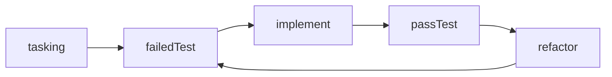
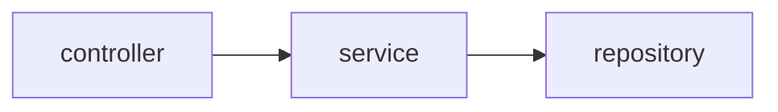

# What is the purpose of differentiating test doubles？

Using well-defined test doubles to describe testing strategies can be particularly useful in guiding developers to write tests that adhere to architectural conventions. It can greatly reduce the learning curve for practicing Test-Driven Development (TDD).

## Test doubles
Here is a collection of widely recognized [test doubles](https://martinfowler.com/bliki/TestDouble.html) that are considered important to be widely disseminated:

- **Dummy** objects are passed around but never actually used. Usually they are just used to fill parameter lists.
- **Fake** objects actually have working implementations, but usually take some shortcut which makes them not suitable for production (an InMemoryTestDatabase is a good example).
- **Stubs** provide canned answers to calls made during the test, usually not responding at all to anything outside what's programmed in for the test.
- **Spies** are stubs that also record some information based on how they were called. One form of this might be an email service that records how many messages it was sent.
- **Mocks** are pre-programmed with expectations which form a specification of the calls they are expected to receive. They can throw an exception if they receive a call they don't expect and are checked during verification to ensure they got all the calls they were expecting.

While these test doubles have clear boundaries, unfortunately, most testing frameworks and mocking libraries provide APIs that support multiple types of test doubles. For example, the jest.fn() function in the Jest framework can act as any of the test doubles:

- Dummy: `fun(jest.fn())`
- Fake: `{ generateUuid: jest.fn().mockImplementationOnce(randomUUID)}`
- Stub/Spy: `{ generateUuid: jest.fn().mockReturnValueOnce('a uuid')}`
- Mock: `expect(jest.fn()).toBeCalledWith('args')`

I was initially confused by the design of these APIs in testing frameworks, and as a result, I didn't see much practical value in using these test doubles. [^1]

However, as I gradually applied TDD in my development process, I discovered that using well-defined test doubles to describe testing strategies is especially beneficial.

## Application in TDD

As we know, TDD follows a basic cycle:

In this article, I won't discuss the value of TDD itself, but in terms of its pain points, I found that writing a failing test is not always easy. Here are some reasons why:

### Lack of architectural breakdown in tasking

Architecture is the higher-level design that exists before the four aforementioned programming activities. Whether you choose a widely used architecture without careful consideration or make architectural decisions through thoughtful deliberation, it is an agreement with your team: "We should implement business value in this way because it offers certain benefits." If the tasking does not follow the architecture, translating the task into corresponding tests that meet the requirements can be challenging.

### Oversized tasks

Tests written for oversized tasks are often ineffective, introducing excessive external dependencies and side effects during the implementation process, resulting in a significant workload in writing the tests themselves.

I believe that a well-defined, testable, architecture-compliant set of tasks can make it easier for developers to write failing tests. Through long-term practice, I have found that tasking based on architecture and testing strategies is a way to ensure the generation of a correct task list: **To implement a target unit, use test doubles to replace its dependencies, provide a specific input, and expect a correct output.**

Let's compare two styles of tasking using an example in a common layered architecture, involving taking a package from a smart locker:

api: patch /slot/{code}
table: {"code": "324156", "id": "slotId1"} --> {"code": null, "id": "slotId1"}

### Tasking based on architecture only

- controller: Invoke slotService, and the controller returns: {status: 200, body: "Package retrieval successful"}

- service： Invoke SlotRepository's findByCode/save methods to update data, and the service returns "Package retrieval successful"

- repository： Use JPA with the correctly named methods findByCode

When different people convert the tasks in the controller layer into tests, significant differences can often be observed, mainly falling into three categories:

1. Using @SpringBootTest to start a test database and verify the results.
2. Using @SpringMVCTest to mock the slotService and verify the returned result and service call.
3. Using regular unit tests to call the controller, mock the slotService, and verify the returned result and service call.

Allowing these three testing approaches to coexist would likely result in confusing test code. In such a situation, whether the architecture can evolve in the desired direction becomes a concern.

### Tasking considering both architecture and testing strategies

#### controller

- Given **Stub** slotService call "324156" and return "Package retrieval successful"
- When post /slot/324156 via springMVC
- Then status: 200 body: "Package retrieval successful"

#### service

- Given **Mock** SlotRepository findByCode/save call
- When retrieval
- Then return "Package retrieval successful" and Verify that the slotRepository's methods are called with the correct parameters

#### repository

- to use JPA interface with a correct naming `findByCode`

It is evident that the use of test doubles provides a clearer description. Alternatively, incorporating the testing strategy into tasking makes the task list appear more explicit. Furthermore, such a task list conceals the intentions reflected in the testing strategy:

In the service layer, the test double used is 'Mock,' which implies that slotService expects a stable API from slotRepository that should not be easily modified. The use of 'Mock' also serves the purpose of ensuring the correct invocation of the repository, as the naming conventions of JPA interfaces make it unlikely for function names to be incorrect. Typically, the service layer undergoes frequent changes, and it is desirable for it to be easily modifiable, such as adding a parameter to a function without breaking any controller code. By using 'Mock,' any modifications to the service layer would require the corresponding modifications in many controller tests, as it verifies a specific behavior: 'the controller calls slotService with the parameter 324156.' This can be improved by using 'Stub,' where only the test double needs to be modified without changing any test assertions. Conversely, using 'Stub' in the controller layer implies a desire for looser coupling with dependencies.

Why not just say it directly? Because of [curse of knowledge](https://en.wikipedia.org/wiki/Curse_of_knowledge), which cannot guarantee a correct understanding by the audience. This approach can yield three outcomes:

1. Upon seeing this testing strategy/task, the intention is understood. -- perfect
2. After using this strategy for a while, the intention is realized. -- great
3. I may not understand, but following this approach yields objective results that align with the architectural vision. -- not bad

In conclusion, by using these well-defined test doubles, they have relatively clear purposes and boundaries, allowing us to express testing intentions in concise language, making it an efficient approach.
