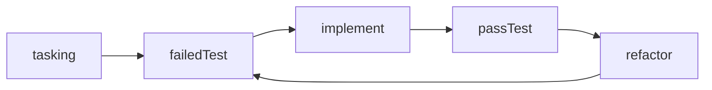
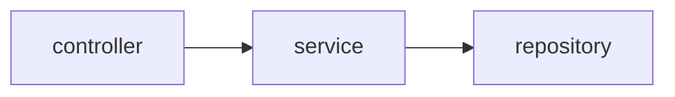

# 区别测试替身有什么用？

用明确定义的测试来替身描述测试策略尤其好用，对指导开发者编写符合架构约定的测试很有帮助，能够极大的降低TDD的实践门槛。

## 测试替身
一组被认为应当广泛传播的[测试替身](https://martinfowler.com/bliki/TestDouble.html):

- **Dummy**: 只进行传递，从不使用的`object`。通常被用来填充参数列表。
- **Fake**: 存在有用实现的`object`。但是其实现通常抄捷径，不能用于生产。处于内存中的测试数据库是个好例子。
- **Stub**: 提供现成的返回结果给测试期间发生的函数调用。通常，除了测试中用到的case外，什么也不会返回。
- **Spy**: 一种的特殊的`Stub`，记录了替身是如何被调用。形如一个邮件服务——记录发送了多少个邮件。
- **Mock**: 编码了一组期待的调用行为，验证所有的调用符合预期。它将在收到意料之外的调用时产生一个异常。

尽管这些替身之间看起来有明确的边界，不幸的是，所有测试框架和替身库提供的API都兼具其中的多种测试替身的能力。比如[Jest](https://jestjs.io)框架中的`jest.fn()`, 它可以成为任何一种测试替身：

- Dummy: `fun(jest.fn())`
- Fake: `{ generateUuid: jest.fn().mockImplementationOnce(randomUUID)}`
- Stub/Spy: `{ generateUuid: jest.fn().mockReturnValueOnce('a uuid')}`
- Mock: `expect(jest.fn()).toBeCalledWith('args')`

我曾一度困惑于这些测试框架的api设计，受其影响，认为这些测试提神替身并没有什么实用价值。[^1]

渐渐的在运用TDD的过程中我发现，用明确定义的测试来替身描述测试策略尤其好用

## TDD下的用武之地

众所周知，TDD的基本步骤：

本文不去讨论TDD的价值，就其痛点而言，我发现实践TDD时，编写一个失败的测试并不容易。原因可能是：

#### 没有按照架构进行任务分解
架构是上层设计，先于以上四个编程活动存在。不论你不加权衡的选择某种广泛使用的架构，还是通过小心的权衡决策出的架构，都是在和你的技术团队达成一种协定：我们应当以这种方式实现业务价值，因为这种方式具有怎样地好处。任务分解若没有遵守架构约定，将task转化为对应的测试时，编写符合需求的测试替身困难重重。
#### 过大的任务
为过大任务编写的测试通常是无效的测试，在实现过程中会引入太多的外部依赖和过多的副作用，造成编写测试本身的工作量很大。

我相信一组可评估的，可测试的，符合架构的任务，是能够使得开发者容易的编写一个失败的测试。长期的实践中发现，基于架构和测试策略进行Tasking是一种确保正确生成任务列表地方式：**为了实现目标架构组件单元，使用测试替身替换其依赖，给定一个特定的输入，期待一个正确的输出。**

下面将用一个例子比较两种tasking的描述风格，考虑在一个常见的分层架构下，实现从丰巢快递柜中取一个快递：

api: patch /slot/{code}
table: {"code": "324156", "id": "slotId1"} --> {"code": null, "id": "slotId1"}

#### 只考虑架构的Tasking：

- controller: 调用slotService，controller返回：{status: 200 body: "取包成功"}

- service： 调用 SlotRepository findByCode/save 更新数据， service返回 "取包成功"

- repository： 使用JPA，正确命名方法 findByCode

不同的人在将controller层的task转化为测试时，常常能看到相当大的差异，基本分为三种：

1. 使用@SpringBootTest，启动一个测试数据库，验证结果
2. 使用@SpringMVCTest，Mock掉slotService，验证返回结果和service call
3. 使用普通单元测试调用controller，Mock掉slotService，验证返回结果和service call

放任这三种测试方式并存，大概会导致混乱的测试代码。在这种情况下，架构能否朝着愿景的方向演进是一个巨大的问题。

#### 同时考虑架构和测试策略的Tasking：

### controller

- Given **Stub** slotService call "324156" and return "取包成功"
- When post /slot/324156 via springMVC
- Then status: 200 body: "取包成功"

### service

- Given **Mock** SlotRepository findByCode/save call
- When 取包
- Then return "取包成功"

### repository

- 使用JPA，正确命名方法 findByCode

不难看出，使用测试替身的描述更为明确。service层使用的测试替身是`Mock`, 这意味着slotService期待slotRepository提供的API是稳定的，不能被轻易的修改。这里的Mock也具有保证正确调用repository的意图，因为JPA的接口命名约定使得函数名不能出错。通常service层是经常变化的，我希望它是容易修改的，比如变更一个函数的参数不会破坏任何的controller代码。使用Mock，意味着你将验证一个具体的行为：“controller将调用slotService并传入参数324156“，这样service的修改将导致诸多controller的测试需要同步修改。使用Stub就会有所改善，只需要修改测试替身，而不用修改任何测试的断言。反过来讲，在controller层使用Stub，意味着我们希望与依赖保持更松散的耦合。

使用这些细分的测试替身，它们有相对明确的用途和边界，能够让我们用精简的语言表达测试意图，不失为一种高效的方式。

更进一步，测试意图的背后，在技术侧，是架构愿景。尽管这种方式，在知识的生产上，不能消除[知识诅咒](https://en.wikipedia.org/wiki/Curse_of_knowledge)，在知识的消费上，不能确保受众理解正确，我们仍能得到三种结果：
1. 看到这个测试策略，就能明白意图 -- perfect
2. 使用这个策略一段时间后，悟到这个意图 -- great
3. 我不理解，但是按照测试策略做事情，客观的结果是符合架构愿景的 -- not bad

因此，我希望下面这个模板能够被广泛使用：
**为了实现[测试目标]，使用[测试替身]替换其[依赖]，给定一个[特定的输入]，期待一个[正确的输出]。**

[^1]: 如果从测试工具的api设计角度来看，我还是认为测试框架将多种替身的能力合并到了一起，在大多数情况下都是一个不错的选择。实践中，选择合适的api使用即可，不必纠结。
