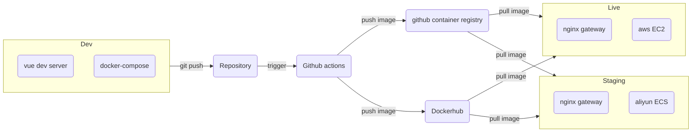
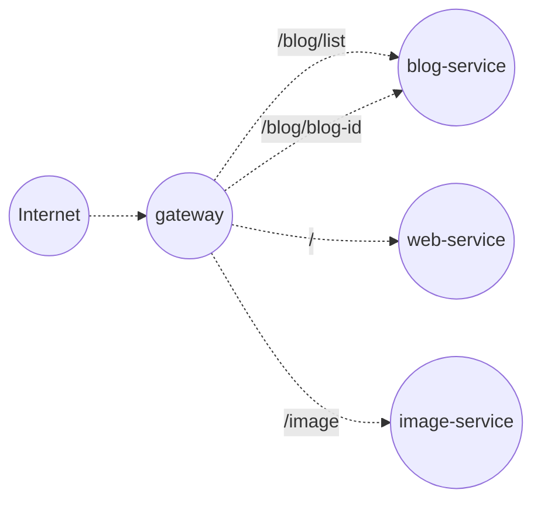
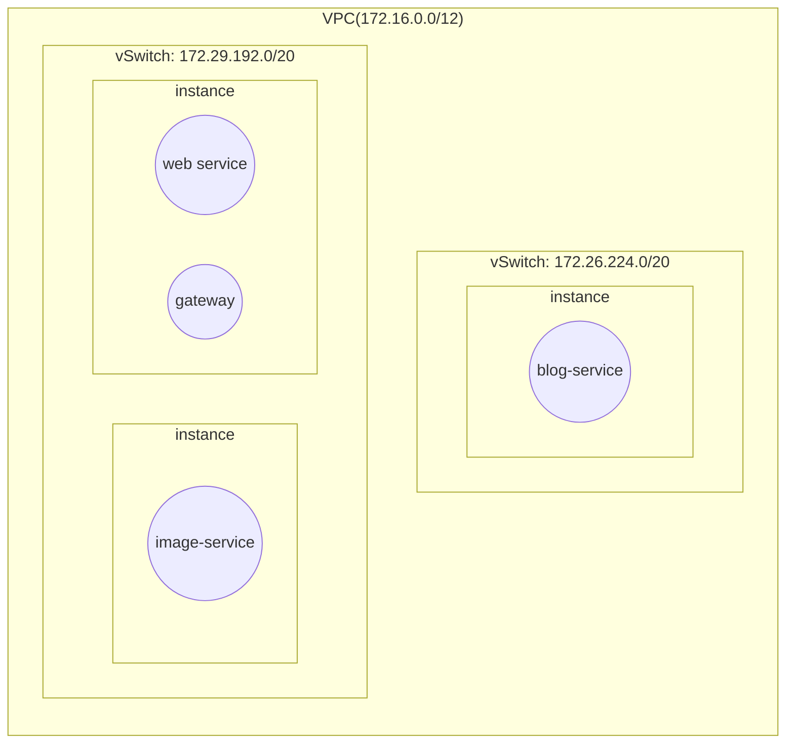
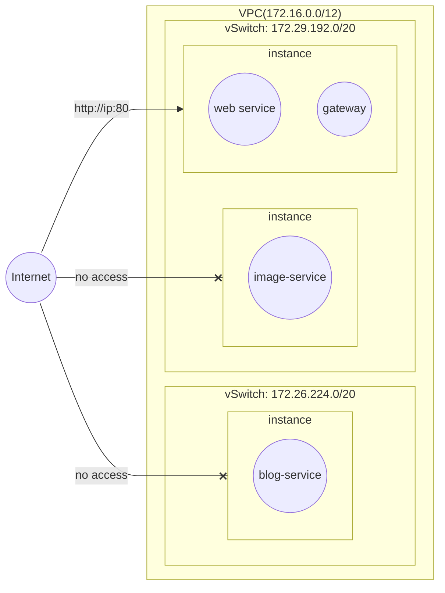
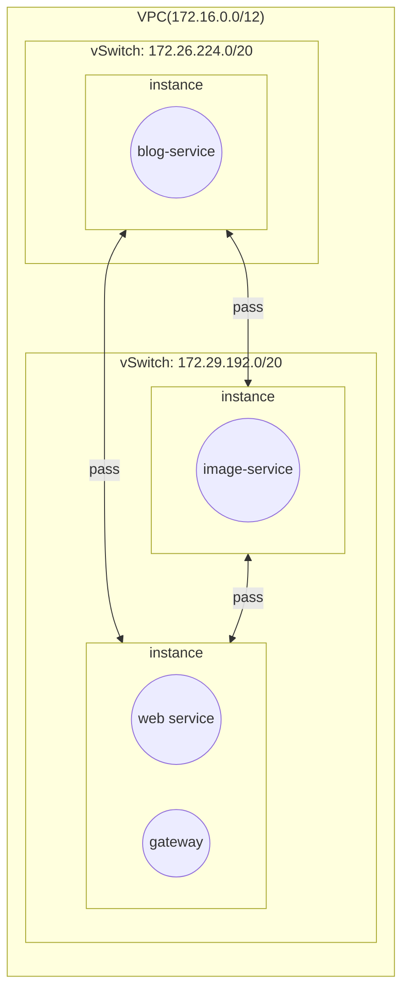
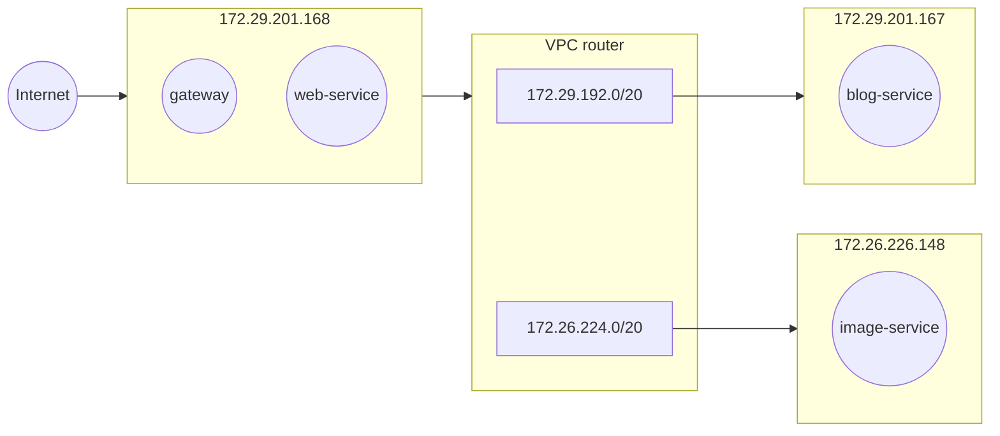

# Devecor website基本建筑

[Devecor website](https://devecor.cn)网站在弹性计算云服务平台上的基本建筑概述

### 持续集成/部署视角

### 微服务架构视角

### 网络结构视角

上图是一张网络结构图，VPC下分配了两个子网，`172.29.192.0/20`下挂载着两个实例，`172.26.224.0/20`下挂载一个实例。

### 访问控制视角

公网连接

内网连接

子网层级的出入网访问全部放通，实例层级通过安全组配置关闭所有端口的入网访问（22端口除外）。保留22号端口是为了留给流水线平台通过ssh密钥对访问，方便实践持续集成和部署。对于出网请求不做任何限制。

为了向公网暴露website服务，仅放通一台实例的80端口入网请求。

### api内网路由视角

