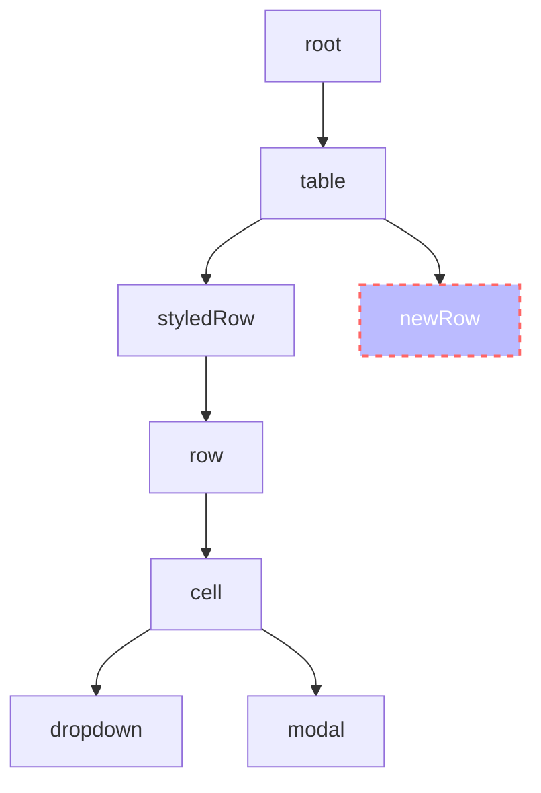

# 基于FSM的React组件设计

## 什么是FSM

## 1. 单组件FSM


1. 似乎暗含了存在六个状态？
2. 看起来需要封装3个组件： row dropdown modal
3. 看起来有复杂的交互


一个组件，3个状态：`RowState: 'row' | 'dropdownOpen' | 'dialogOpen'`

## 2. state数量越少越好

```
RowState: 'row' | 'dropdownOpen' | 'dialogOpen'
```

```
isDialogOpen: boolean
isDropdownOpen: boolean
isRowHighlight: boolean
```

## 3. state需要被封装在合适的位置



```typescript
const [cellState, setCellState] = useState('row')

setCellState('dropdown')
setRowStyle('highlight')
```
